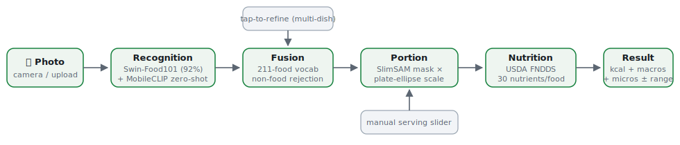

# 🍽️ NutriLens

**A production-quality, fully offline food-recognition and nutrition-estimation
PWA.** Photograph any meal; get the dish, calories, macros and a full
micronutrient profile with confidence ranges — computed **100% on your device**.
No backend, no cloud APIs, no telemetry; after the first visit it works in
airplane mode.



## Highlights

- **Recognition** — Swin-Base fine-tuned on Food-101 (92% top-1) **fused** with
  a MobileCLIP-S0 open-vocabulary head (211-food vocabulary incl. Indian, East
  Asian, fruits, breakfast foods) and non-food rejection.
- **Portion estimation** — SlimSAM segmentation + a custom RANSAC plate-ellipse
  detector turn mask area into grams with explicit uncertainty; always
  user-adjustable (slider + FNDDS household measures).
- **Nutrition** — USDA FNDDS 2021-2023: 30 nutrients (energy, macros, 11
  minerals, 12 vitamins, cholesterol, fatty-acid classes) per food, %DV, ranges.
- **PWA** — installable, offline-first service worker, camera/upload/drag-drop/
  paste, tap-to-refine multi-dish flow, history (IndexedDB), dark mode.
- **All inference in a Web Worker** on ONNX Runtime Web (multi-threaded WASM;
  WebGPU opt-in via `?webgpu=1`).
- **Five reusable MIT libraries** under `packages/` — each with clean API,
  JSDoc, unit tests and README, publishable independently.
- **Automated evaluation** — reproducible accuracy/calibration/latency reports
  on the Food-101 validation split + an extended Indian-food set, running the
  *identical* library code in Node.

## Quick start

```bash
npm install
npm run fetch-assets       # models (~230 MB) + USDA FNDDS data
npm run build:db           # FNDDS → app/public/data/nutrition-db.json
npm run build:embeddings   # MobileCLIP label embeddings (text tower runs at build time only)
node tools/make-icons.mjs  # PWA icons

npm run dev                # http://localhost:5199
npm run build && npm run preview   # production build + local serve
```

**Serving requirements:** any static file host. Serve with
`Cross-Origin-Opener-Policy: same-origin` and
`Cross-Origin-Embedder-Policy: require-corp` to unlock multi-threaded WASM
(the app still works single-threaded without them). HTTPS (or localhost) is
required for camera + service worker.

### Install as an app

Open the site in Chrome/Edge (desktop or Android) → "Install NutriLens".
First analysis downloads the models with a progress bar (~135 MB, cached
permanently); Settings → *Download all models* prefetches everything explicitly.
After that: fully offline.

## Repository layout

```
packages/
  image-preprocess/    RawImage ops + tensors + CV primitives (0 deps, isomorphic)
  food-recognition/    Swin closed-set + CLIP zero-shot heads + calibrated fusion
  food-segmentation/   SlimSAM wrapper + pure-JS mask utilities
  portion-estimator/   RANSAC plate-ellipse scale reference + area→grams model
  nutrition-engine/    offline nutrition DB engine (scaling, %DV, search, ranges)
app/                   the PWA (Vite, vanilla ES modules, Web Worker inference)
tools/                 build-time pipelines: asset fetch, FNDDS→DB, embeddings, icons
eval/                  dataset fetch + evaluation harness + report generation
docs/                  research, architecture, models, datasets, testing, compat
```

## Tests & evaluation

```bash
npm test                   # 39 unit tests across all packages (vitest)
node eval/browser-smoke.mjs   # end-to-end PWA test in headless Chrome
npm run eval:fetch         # Food-101 val subsample (25/class) + Indian food set
npm run eval               # run both heads over every image (Node, same code as browser)
npm run eval:report        # ACCURACY_REPORT.md + PERFORMANCE_REPORT.md + fusion sweep
```

See [docs/RESEARCH.md](docs/RESEARCH.md) for why each model/database/runtime was
chosen, [docs/ARCHITECTURE.md](docs/ARCHITECTURE.md) for the system design, and
[eval/results/](eval/results/) for the generated reports.

## Privacy & disclaimer

Photos never leave the device; there is nothing to send them to. Nutrition
values are estimates derived from USDA reference data and single-image portion
approximation — informational, not medical advice.

## Licenses

Code: MIT. Models: Swin-Food101 (Apache-2.0), MobileCLIP-S0 (Apple AML, via
Xenova ONNX export), SlimSAM (MIT/Apache-2.0). Data: USDA FoodData Central
(public domain), Food-101 (research dataset, evaluation only).
