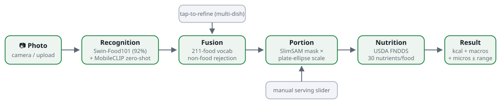

# 🍽️ NutriLens

**A production-quality, fully offline food tracker with on-device recognition.**
A complete food diary — search, barcode scan, serving sizes, custom foods,
recipes, exercise, weight and a nutrition dashboard — plus the part no other
tracker does locally: photograph a plate and get every dish, its portion and its
full micronutrient profile. Everything is computed **100% on your device**. No
backend, no account, no cloud APIs, no telemetry; after the first visit it works
in airplane mode.



## Does the number match what a person sees?

That is the only question a food tracker is judged on, so it has its own
benchmark: `npm run test:vision` runs the shipped pipeline end to end over 20
photographed plates and scores the dish names and the calories against what a
careful human reader says is on them (`eval/vision-truth.json`). A full run
rewrites [eval/results/VISION_BENCH.md](eval/results/VISION_BENCH.md), so the
published numbers are always the ones the current code produces.

A photo is read as **one dish**, named from the whole frame. Splitting a plate
into separate items is a button, not the default — it finds more on a thali, and
it also puts food in the diary that was never on the plate.

| | one dish (default) | split plate (opt-in) |
|---|---|---|
| Calories inside the accepted band | 14 / 20 | 16 / 20 |
| Mean calorie error | 13.7% | 4.1% |
| Dishes named correctly | 52.1%¹ | 85.0% |
| **Dishes invented that were not there** | **6** | **16** |
| **Same answer when the file is re-saved** | **17 / 20** | 7 / 20 |
| Seconds per photo | **2.6** | 11.7 |

¹ One dish named on a thali of five scores 1/5 by construction; this is the cost
of the default, not a fault in it. Nine of the twenty photos are right on both
dish and portion with nothing to touch, five want the portion nudged, six name
the wrong dish and take one tap to correct.

The split path is better on every measure and worse to use. Its extra dishes are
scored 0.26–0.99 confident against 0.40–1.00 for real ones, so no threshold can
separate them — they have to be spotted and deleted by the person logging.
Naming one dish makes that failure impossible rather than filtered.

One image file gives the same dishes and the same calories on every run, and
every photo is analysed at one fixed resolution (`ANALYSIS_SIDE`, 1280 px) so
the framing handed to the models never depends on the camera.

**Stable across copies of the same photograph**, which it was not: re-encoding a
picture as PNG rather than JPEG — a change no eye can see — used to move the
answer by up to 67%, because portions were scaled by a segmentation mask that
swung 6.5× under that noise. Portions are now the food's own typical serving and
nothing is segmented on the default path, which also took a photo from 11.7 s to
2.6 s. `npm run test:stability` re-encodes every benchmark photo five ways and
fails the build if a portion moves.

Seventeen of the twenty give an identical answer every time. The other three
change *dish name* — `biryani`/`poha` and `kung-pao-chicken`/`general-tso-chicken`
are near ties in the classifier, and noise picks the winner. That is a real
remaining defect, pinned by the gate so it cannot grow. See
[eval/results/VISION_BENCH.md](eval/results/VISION_BENCH.md).

Time per photo is 9–32 s on a laptop CPU, depending on what else it is doing.

Before the accuracy rebuild, on the 19 plates that existed then: 10/19 inside
the band, 13/19 within 25%, 31.7% mean calorie error, 54.7% of dishes named,
26 invented.

What moved the numbers, in order of size:

1. **Plate detection was always "certain".** Confidence came from counting
   edge inliers against the rim's circumference, which saturates on any busy
   food photo — a collage with no plate in it scored 1.0 and got priced with a
   26 cm ruler. It now measures *angular coverage*: how much of the rim is
   actually evidenced, all the way round.
2. **Portions are anchored to the food's own typical serving** and moved by a
   bounded factor from how large the helping looks, rather than computed from
   area outright. A bowl rim and a dinner plate both fit an ellipse but differ
   2.6× in area, and that is how a naan became 22 g and half an omelette 605 g.
3. **A region crop is a weak classifier input; the whole photo is a strong
   one.** One corner of a dosa really does look like tempura. Region labels are
   now re-ranked under the whole-image distribution.
4. **One dish, one diary line.** Regions that resolve to the same food — or
   that touch and largely agree about what they are — merge, which fixed both
   "Dosa 24 g + Dosa 86 g" and the plate that was two stir-fries.
5. **The plate detector used `Math.random()`**, so the same photo gave
   different calories on every analysis. It is seeded now.

## Measured accuracy (see eval/results/ACCURACY_REPORT.md)

Measured 2026-07-17, against the 231-food vocabulary of that release.

| | Food-101 val subsample (2,523 imgs) | Extended Indian set (259 imgs) |
|---|---|---|
| **Fused top-1 (shipped)** | **90.4%** | **81.1%** |
| Fused top-5 | 98.4% | 96.5% |
| False "not food" rate | 0.1% | 0.0% |
| Calibration (ECE) | 0.015 | – |

Fusion beats the fine-tuned classifier alone (90.2%) on its own turf *while*
recognizing hundreds of foods outside its training set.

### Per-cuisine (Food-101 slice + dedicated Wikimedia Commons / HF sets)

| Cuisine | images | top-1 | top-5 |
|---|---|---|---|
| Japanese | 175 | 92.6% | 99.4% |
| Korean | 25 | 96.0% | 100% |
| Thai | 25 | 96.0% | 100% |
| Vietnamese | 25 | 100% | 100% |
| Chinese | 234 | 77.8% | 95.3% |
| Indian | 369 | 76.7% | 95.4% |
| Spanish | 125 | 72.8% | 92.0% |
| Mexican | 277 | 70.0% | 87.4% |

Cuisines dominated by zero-shot-only classes (no Food-101 coverage) score
lower on top-1 but stay strong on top-5 — the UI surfaces the top-5
suggestions, so a one-tap correction covers most misses. Hardest classes are
visually ambiguous by nature (enchiladas vs. huevos rancheros, refried beans,
biryani vs. pulao); see the per-class table in the report.

## Highlights

- **The diary** — meals, serving sizes with a serving count, one-tap repeats from
  Recent/Frequent, quick add, edit-in-place, copy a meal to another day, logging
  streaks, notes, and "complete this entry" with a five-week weight projection.
- **Barcode scanning** — own EAN-13/EAN-8/UPC-A decoder (`packages/barcode`), with
  the native `BarcodeDetector` used when present; products come from Open Food
  Facts and are cached, so re-scanning works offline forever.
- **Your own food** — create foods from a nutrition label, save reusable meals,
  and build recipes that divide into servings.
- **Exercise** — MET database (2011 Compendium) with the ACSM energy formula,
  cardio and strength, credited back to the day's calories.
- **Dashboards** — calories by meal, macro split, every nutrient against its
  target, day or week; weight and calorie trends over 30/90/365 days.
- **Recognition** — Swin-Base fine-tuned on Food-101 (90.2% measured top-1)
  **fused** with a MobileCLIP-S2 open-vocabulary head (238-food vocabulary
  incl. Indian, East Asian, fruits, breakfast foods) and non-food rejection,
  plus a linear probe over the same frozen embeddings — trusted on 26 classes
  for a whole photo and on the four hand-labelled region types anywhere, because
  a probe trained on photographs is confidently wrong on a tight crop.
- **Portion estimation** — SlimSAM segmentation + a custom RANSAC plate-ellipse
  detector turn mask area into grams with explicit uncertainty; always
  user-adjustable (slider + FNDDS household measures).
- **Nutrition** — USDA FNDDS 2021-2023: 238 foods × 31 nutrients (energy,
  macros, 9 minerals, 11 vitamins, choline, cholesterol, fatty-acid classes), %DV,
  ranges. Dishes FNDDS only lists in a form nobody eats (caesar salad *without*
  dressing) are composed as mass-weighted mixtures of FNDDS rows, so every
  value still traces to USDA data — and the provenance test recomputes the
  recipe to prove it.
- **Breadth without going online** — a further 1,744 dishes (53 KiB gzipped)
  computed at build time by two Claude models that cross-check each other and
  USDA, shipped as static JSON and searched alongside the measured foods but
  always ranked below them and labelled "Estimate". Nothing calls a model at
  runtime; the app has no network path to one.
- **PWA** — installable, offline-first service worker, camera/upload/drag-drop/
  paste, tap-to-refine multi-dish flow, IndexedDB storage, CSV export, dark mode.
- **All inference in a Web Worker** on ONNX Runtime Web (multi-threaded WASM;
  WebGPU opt-in via `?webgpu=1`).
- **Eleven reusable MIT libraries** under `packages/` — each with a clean API,
  JSDoc and unit tests, publishable independently. A twelfth,
  `claude-nutrition`, is build-time only and not published.
- **Automated evaluation** — reproducible accuracy/calibration/latency reports
  on the Food-101 validation split + an extended Indian-food set, running the
  *identical* library code in Node.

**Live deployment:** https://nutrilens-e4o.pages.dev (Cloudflare Pages, free tier).
Files over Pages' 25 MiB cap are chunked at build time by `tools/split-models.mjs`
and reassembled client-side. Deploy updates with:

```bash
npm run build && node tools/split-models.mjs
npx wrangler pages deploy app/dist --project-name nutrilens
```

## Quick start

```bash
npm install
npm run fetch-assets       # models (~230 MB) + USDA FNDDS data
npm run build:db           # FNDDS → app/public/data/nutrition-db.json
npm run build:embeddings   # MobileCLIP label embeddings (text tower runs at build time only)
node tools/make-icons.mjs  # PWA icons

npm run dev                # http://localhost:5199
npm run build && npm run preview   # production build + local serve
```

**Serving requirements:** any static file host. Serve with
`Cross-Origin-Opener-Policy: same-origin` and
`Cross-Origin-Embedder-Policy: require-corp` to unlock multi-threaded WASM
(the app still works single-threaded without them). HTTPS (or localhost) is
required for camera + service worker.

### Install as an app

Open the site in Chrome/Edge (desktop or Android) → "Install NutriLens".
First analysis downloads the models with a progress bar (~180 MB, cached
permanently); Settings → *Download all models* prefetches everything explicitly.
After that: fully offline.

## Repository layout

```
packages/
  image-preprocess/    RawImage ops + tensors + CV primitives (0 deps, isomorphic)
  food-recognition/    Swin closed-set + CLIP zero-shot heads + calibrated fusion
  food-segmentation/   SlimSAM wrapper + pure-JS mask utilities
  portion-estimator/   RANSAC plate-ellipse scale reference + area→grams model
  nutrition-engine/    offline nutrition DB engine (scaling, %DV, search, ranges)
  claude-nutrition/    build-time only: compute a dish, cross-verify, adjudicate
  diary/               serving maths, day totals, streaks, projections, CSV export
  exercise-db/         MET activity table + ACSM energy expenditure
  barcode/             EAN-13/EAN-8/UPC-A encoder + scanline image decoder
  off-food/            Open Food Facts product → food record (unit-corrected)
  charts/              dependency-free SVG donut/bar/column/line charts
  plate-analyzer/      region proposals → named dishes with masses (multi-dish logic)
app/                   the PWA (Vite, vanilla ES modules, Web Worker inference)
  src/today.js         diary screen        src/logfood.js    add-food flow
  src/nutrition-view.js dashboards         src/progress-view.js weight & trends
  src/foods.js         one lookup over USDA + your foods + products + recipes
  src/readout.js       tick scales — the signature chart element
  src/icons.js         the drawn icon set (the only place an icon path lives)
tools/                 build-time pipelines: asset fetch, FNDDS→DB, embeddings, icons
eval/                  dataset fetch + evaluation harness + report generation
docs/                  research, architecture, models, datasets, testing, compat, design
```

## Tests & evaluation

```bash
npm test                   # 308 unit tests across all packages (vitest), including:
                           #  · every per-100 g value traced back to the FNDDS CSVs
                           #  · every food × nutrient × 11 portion sizes recomputed
npm run test:vision        # dish names + calories vs human ground truth on 20
                           #   photographed plates (the "does it match" benchmark)
npm run test:nutrition-ui  # rendered kcal/macros/micros/%DV vs an independent
                           #   oracle, across 12 foods, plate totals and the diary
npm run test:tracker       # every tracker flow end to end: goals, serving-size
                           #   logging, editing, quick add, custom foods, recipes,
                           #   barcode, exercise, habits, copy-day, dashboard
npm run test:smoke         # end-to-end PWA test in headless Chrome
npm run test:offline       # proves full analysis works with the network disabled
npm run eval:fetch         # Food-101 val subsample (25/class) + Indian food set
npm run eval               # run both heads over every image (Node, same code as browser)
npm run eval:report        # ACCURACY_REPORT.md + PERFORMANCE_REPORT.md + fusion sweep
```

See [eval/results/VISION_BENCH.md](eval/results/VISION_BENCH.md) for the
per-photo scores behind the table above,
[docs/RESEARCH.md](docs/RESEARCH.md) for why each model/database/runtime was
chosen, [docs/ARCHITECTURE.md](docs/ARCHITECTURE.md) for the system design,
[docs/DESIGN.md](docs/DESIGN.md) for the palette, type, icon and layout rules,
and [eval/results/](eval/results/) for the generated reports.

## Privacy & disclaimer

Photos never leave the device; there is nothing to send them to. Nutrition
values are estimates derived from USDA reference data and single-image portion
approximation — informational, not medical advice.

## Licenses

Code: MIT. Models: Swin-Food101 (Apache-2.0), MobileCLIP-S2 (Apple AML, via
Xenova ONNX export), SlimSAM (MIT/Apache-2.0). Data: USDA FoodData Central
(public domain), Food-101 (research dataset, evaluation only).
